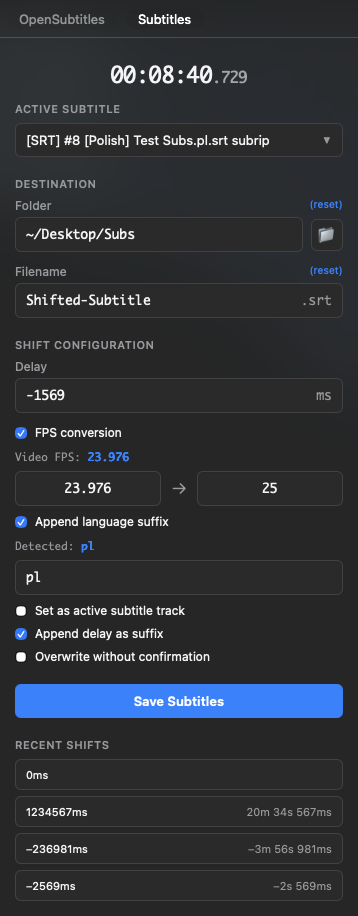

# Save Subtitles for IINA

SRT subtitle export (with optional retiming) plugin for [IINA media player](https://iina.io/).

## Features

- **Delay Detection**: Automatically syncs with IINA's subtitle delay
- **Precise Shifting**: Offset using milliseconds or flexible timecodes
- **FPS Conversion**: Eliminates progressive drift via FPS matching
- **Smart Filenames**: Optional language and delay suffixes
- **SRT Optimization**: Fixes common issues during export, including:
  - **Re-indexing**: Sequential numbering of all SRT blocks
  - **Cleanup**: Removal of redundant empty lines and blocks
  - **Time-clipping**: Removal of subtitles shifted before video start
- **Track Selection**: Quickly switch between available subtitle tracks
- **Shift History**: Clickable list of recently used offsets

## Usage

Access the **Save Subtitles** sidebar in two ways:

- **Menu**: `Plugin` → `Subtitles...`
- **Keybind**: <kbd>⌘</kbd> + <kbd>D</kbd>

> [!TIP]
> Keybind can be modified or disabled via the plugin's **Preferences**

## Installation

**Requirement**: IINA 1.4.0 or later.

Install the plugin using one of these methods:

- **GitHub**: In **IINA Settings** → **Plugins**, click **Install from GitHub...** and enter `bbeny123/iina-save-subs`
- **Manual**: Download the `.iinaplgz` file from the [latest release](../../releases)

## Alternative: Userscript

This plugin is an extended version of the original single-file userscript (see [userscript/README.md](userscript/README.md) for details).
